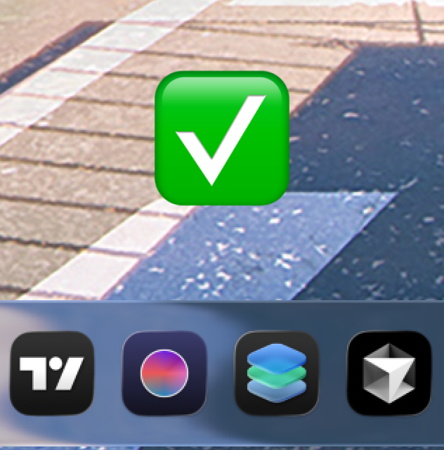
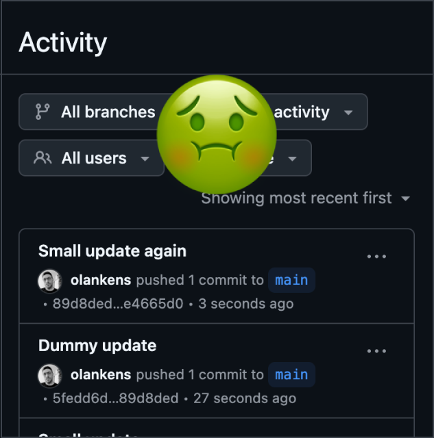
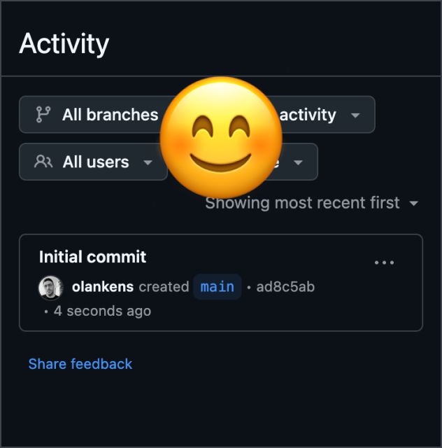

<hr>

# OVERVIEW

A collection of bash scripts for various system tasks, executable directly via curl. No installation required, just run scripts on-demand for system administration, development setup, security configuration, and utility operations.

<hr>

# GUIDANCE

### Create ICNS for Tahoe



Tahoe ICNS files need 10% padding, which many icons from [macOSicons](https://macosicons.com/) lack. This command generates a properly padded ICNS from a 1024×1024 PNG file, ideally exported from the [Icon Composer](https://developer.apple.com/icon-composer/) application.

```shell
curl -fsSL https://raw.githubusercontent.com/olankens/curlmate/HEAD/src/create-tahoe-icns.sh | bash
```

### Reset GitHub Repository



```shell
curl -fsSL https://raw.githubusercontent.com/olankens/curlmate/HEAD/src/reset-github-repository.sh | bash
```

### Simplify SVG files


```shell
curl -fsSL https://raw.githubusercontent.com/olankens/curlmate/HEAD/src/simplify-svg-files.sh | bash
```

<hr>
