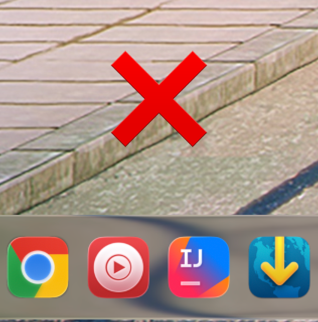
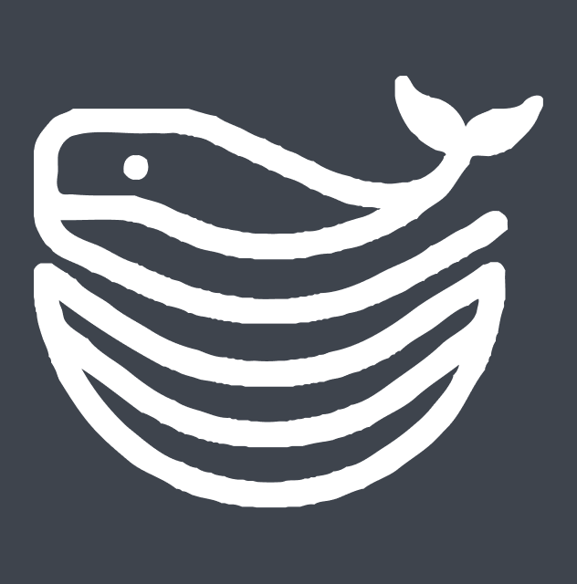
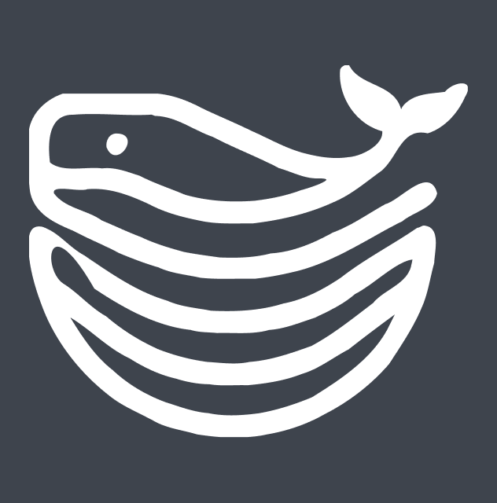

<div align="center">
    <picture>
        <source media="(prefers-color-scheme: dark)" srcset=".assets/icon-dark.svg">
        
    </picture>
    <h1><samp>CURLMATE</samp></h1>
    <p>A collection of bash scripts for various system tasks, executable directly via curl. No installation required, just run scripts on-demand for system administration, development setup, security configuration, and utility operations.</p>
</div>

---

<h3 align="center">Create ICNS for Tahoe</h3>



```shell
curl -fsSL https://raw.githubusercontent.com/olankens/curlmate/HEAD/src/create-tahoe-icns.sh | bash
```

---

<h3 align="center">Reset GitHub Repository</h3>


```shell
curl -fsSL https://raw.githubusercontent.com/olankens/curlmate/HEAD/src/reset-github-repository.sh | bash
```

---

<h3 align="center">Simplify SVG files</h3>



```shell
curl -fsSL https://raw.githubusercontent.com/olankens/curlmate/HEAD/src/simplify-svg-files.sh | bash
```

---

<h3 align="center">Commit Latest Changes</h3>


```shell
curl -fsSL https://raw.githubusercontent.com/olankens/curlmate/HEAD/src/commit-latest-changes.sh | bash
```

---

<h3 align="center">GitHub Markdown for JetBrains</h3>


```shell
curl -fsSL https://raw.githubusercontent.com/olankens/curlmate/HEAD/src/setup-jetbrains-markdown.sh | bash
```
